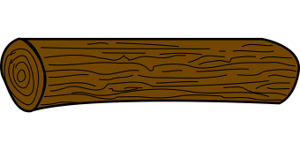

<div align="center"></div>

# Coolog

Coolog is a logging interface based upon [Chris Hines' Slide Deck](https://go-talks.appspot.com/github.com/ChrisHines/talks/structured-logging/structured-logging.slide) and [gokit's log package](https://pkg.go.dev/github.com/go-kit/kit@v0.10.0/log).

The motivation for this package can be [found here](https://briankovacs.medium.com/golang-interfaces-60e459ebd7c0).

This library is meant as a common interface to be able to implement any type of log package like github.com/sirupsen/logrus or go.uber.org/zap.

So where you need a logger in your code, do this:
``` go
func funcWhichPassesLogger(log *coolog.Logger) {

}
```

That way, any logger which implements this logging interface is good to go. Using a different kind of method than we are used to:
``` go
Print(level string, msg string, data ...map[string]interface{}) error
```

So to call the logger, we need to pass the level (which has defaults depending upon the implementation currently in this library -- aka zap or logrus), the message string, and and detail fields.
``` go
logLevel := "info"
logFilename := "/var/log/your_log_mang.log"
logType := "text"

log, err := coolog.NewLogrusLogger(logLevel , logFilename, logType)
if err != nil {
    // handle d stuff mang!
}

log.Print("error", "this is a serious thing you did wrong, mang", map[string]interface{}{"key1":"value1", "key2":"value2"})
```
